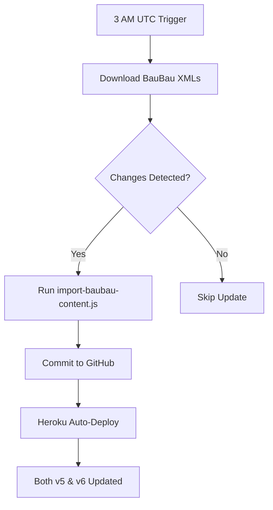

# GitHub Actions & TMDB Integration

## Overview

Your GitHub Actions workflows handle automatic content updates from BauBau API. With the new TMDB-based v6 addon, the workflow strategy changes slightly.

## Current Workflows

### 1. Daily Auto-Update (`update-content.yml`)
- **Frequency**: Daily at 3 AM UTC
- **Purpose**: Download latest BauBau content
- **Updates**: `data/baubau-content.json`
- **Status**: ✅ Works for both v5 and v6

### 2. Manual Update (`manual-update.yml`)
- **Trigger**: Manual via GitHub UI
- **Purpose**: Force update or refresh all content
- **Updates**: Same as daily update
- **Status**: ✅ Works for both v5 and v6

### 3. TMDB Cache Refresh (`update-tmdb-cache.yml`) - NEW
- **Frequency**: Weekly on Sundays
- **Purpose**: Verify TMDB API health and stream database
- **Status**: 🆕 New workflow for v6

---

## How Workflows Affect Each Addon

### Version 5 (Port 7005) - Legacy Approach

```yaml
GitHub Actions → baubau-content.json
                      ↓
              ┌───────────────────┐
              │  v5 Addon         │
              │  • Metadata ✅    │
              │  • Streams ✅     │
              └───────────────────┘
```

**Impact:**
- ✅ New movies appear with full metadata
- ✅ New streams immediately available
- ✅ Updates reflected within seconds
- ❌ Limited to your database content only

### Version 6 (Port 7006) - TMDB Approach

```yaml
GitHub Actions → baubau-content.json
                      ↓
              ┌───────────────────┐
              │  v6 Addon         │
              │  • Metadata: TMDB │
              │  • Streams: DB ✅ │
              └───────────────────┘
```

**Impact:**
- ✅ New stream URLs updated
- ✅ Stream matching improved with fresh data
- ⚠️ Movies already visible via TMDB (unlimited catalog)
- ✅ Your value = Direct HD streams

---

## Workflow Details

### Daily Update Flow



### What Gets Updated

| File | v5 Uses For | v6 Uses For |
|------|-------------|-------------|
| `baubau-content.json` | Full metadata + streams | Stream URLs only |
| `archive/analysis/*.xml` | Source data (archived) | Source data (archived) |

---

## Configuration for v6

### Required: TMDB API Key

For v6 to work on Heroku, you need to configure the TMDB API key:

#### Option 1: Heroku Config Vars (Recommended)

```bash
# Set via Heroku CLI
heroku config:set TMDB_API_KEY="your_tmdb_api_key" -a your-app-name

# Or via Heroku Dashboard:
# Settings → Config Vars → Add:
#   Key: TMDB_API_KEY
#   Value: your_tmdb_api_key
```

#### Option 2: GitHub Secrets (For Workflows)

```yaml
# Add to repository secrets:
Settings → Secrets and variables → Actions → New repository secret
Name: TMDB_API_KEY
Value: your_tmdb_api_key
```

---

## Deployment Strategy

### Recommended: Dual Deployment

Run both addons simultaneously:

```yaml
# Heroku: Use Procfile to specify which addon to run

# For v5 (legacy):
web: node addon-v5.js

# For v6 (TMDB):
web: node addon-tmdb-catalogs.js

# For both (requires multiple dynos):
web: node addon-v5.js
worker: node addon-tmdb-catalogs.js
```

### Alternative: Feature Flag

```javascript
// In addon startup
const USE_TMDB = process.env.USE_TMDB === 'true';

if (USE_TMDB) {
  require('./addon-tmdb-catalogs.js');
} else {
  require('./addon-v5.js');
}
```

---

## Monitoring & Alerts

### What to Monitor

1. **Stream Database Updates**
   - Check if GitHub Actions runs successfully
   - Verify `baubau-content.json` gets updated
   - Monitor file size growth

2. **TMDB API Health** (v6 only)
   - Weekly verification via `update-tmdb-cache.yml`
   - Alert if API key expires
   - Monitor rate limits (TMDB free tier: 40 requests/10 seconds)

3. **Heroku Deployment**
   - Auto-deploy should trigger after GitHub push
   - Both ports should be accessible
   - Check logs for TMDB API errors

### GitHub Actions Badges

Add to your README:

```markdown


```

---

## Troubleshooting

### Workflow Fails: "No changes to commit"

This is **normal** - it means BauBau hasn't added new content.

### TMDB API Key Invalid

```yaml
# Check in workflow logs:
❌ TMDB API key is invalid or expired

# Fix:
1. Generate new key at themoviedb.org
2. Update Heroku: heroku config:set TMDB_API_KEY="new_key"
3. Update GitHub secret
```

### Streams Not Matching TMDB Content

```javascript
// v6 addon logs will show:
✅ Stream match found: Underground → Underground
❌ No streams found for New Movie (2024)

// Improve matching:
1. Ensure database has accurate years
2. Check title spelling matches TMDB
3. Add alternative titles to your database
```

### Heroku Doesn't Auto-Deploy

```bash
# Check Heroku-GitHub connection:
heroku git:remote -a your-app-name
heroku labs:enable runtime-dyno-metadata

# Verify in Heroku Dashboard:
Deploy → GitHub → Connect to ZeroQ-Cool/Balkan-On-Demand
Enable Automatic Deploys
```

---

## Performance Optimization

### Cache Strategy

**v5 (Current):**
- In-memory cache for Cinemeta/OMDb
- Clears on server restart
- Rebuilds gradually

**v6 (TMDB):**
- In-memory cache for TMDB responses
- Clears on server restart
- 30-day cache recommended (add later)

### Rate Limit Management

TMDB Free Tier:
- **40 requests per 10 seconds**
- **1000 requests per day** (soft limit)

Your addon usage:
- Catalog page: ~20 requests (one per page)
- Detail page: 1 request
- Stream request: 1 request (only if not cached)

**Recommendation**: Add persistent cache layer if catalog traffic > 500/day

---

## Migration Checklist

- [x] Create new TMDB addon file
- [x] Update React config app
- [x] Add documentation
- [x] Push to GitHub
- [ ] Get TMDB API key
- [ ] Add TMDB_API_KEY to Heroku
- [ ] Add TMDB_API_KEY to GitHub Secrets
- [ ] Test v6 locally
- [ ] Deploy v6 to Heroku
- [ ] Test both addons in Stremio
- [ ] Monitor GitHub Actions
- [ ] Update README with new addon URL

---

## Future Enhancements

### Potential Workflow Improvements

1. **Smart Cache Pre-warming**
   ```yaml
   - name: Pre-warm TMDB cache
     run: |
       # Fetch metadata for all new content
       node scripts/prewarm-tmdb-cache.js
   ```

2. **Content Validation**
   ```yaml
   - name: Validate stream URLs
     run: |
       # Check if stream URLs are still accessible
       node scripts/validate-streams.js
   ```

3. **Notification on Updates**
   ```yaml
   - name: Notify Discord
     if: steps.check_changes.outputs.changed == 'true'
     uses: discord-webhook@v1
     with:
       webhook: ${{ secrets.DISCORD_WEBHOOK }}
       message: "🎬 New content added: ${{ steps.stats.outputs.movies }} movies"
   ```

---

## Summary

✅ **Your GitHub Actions workflows remain fully functional with v6**

The key difference:
- **v5**: GitHub Actions updates = Full content updates
- **v6**: GitHub Actions updates = Stream URLs only (TMDB provides metadata)

Both approaches work simultaneously with the same database!
